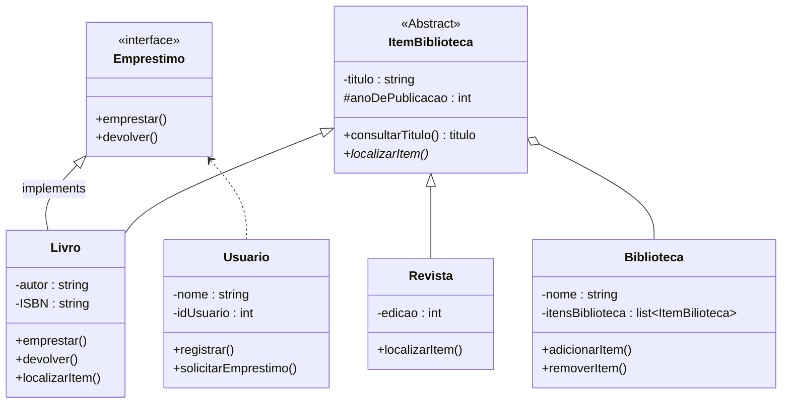

```mermaid
classDiagram
    class Emprestimo
    <<interface>> Emprestimo
    Emprestimo: +emprestar()
    Emprestimo: +devolver()

    class ItemBiblioteca
    <<Abstract>> ItemBiblioteca
    class ItemBiblioteca {
        -titulo : string
        #anoDePublicacao : int
        +consultarTitulo() titulo
        +localizarItem()*
    }

    class Livro {
        -autor : string
        -ISBN : string
        +emprestar()
        +devolver()
        +localizarItem()
    }

    class Revista {
        -edicao : int
        +localizarItem()
    }

    class Usuario {
        -nome : string
        -idUsuario : int
        +registrar()
        
        %% depende de Emprestimo
        +solicitarEmprestimo()
    }

    class Biblioteca {
        -nome : string
        -itensBiblioteca : list~ItemBilioteca~
        +adicionarItem()
        +removerItem()
    }

    %% Livro herda de ItemBilioteca e implementa Emprestimo
    Emprestimo <|-- Livro : implements
    ItemBiblioteca <|-- Livro

    %% Revista herda de ItemBiblioteca
    ItemBiblioteca <|-- Revista

    %% Usuario.solicitarEmprestimo() depende de Emprestimo
    Emprestimo <.. Usuario

    %% Objetos de ItemBiblioteca podem ser passados pra variável itensBiblioteca
    ItemBiblioteca o-- Biblioteca %% Agregação
```
