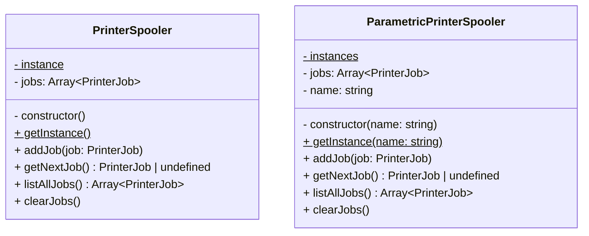

```mermaid
classDiagram
    class PrinterSpooler {
        - instance$
        - jobs: Array~PrinterJob~
        - constructor()
        + getInstance()$
        + addJob(job: PrinterJob)
        + getNextJob() PrinterJob | undefined
        + listAllJobs() Array~PrinterJob~
        + clearJobs()
    }

    class ParametricPrinterSpooler {
        - instances$
        - jobs: Array~PrinterJob~
        - name: string
        - constructor(name: string)
        + getInstance(name: string)$
        + addJob(job: PrinterJob)
        + getNextJob() PrinterJob | undefined
        + listAllJobs() Array~PrinterJob~
        + clearJobs()
    }
```